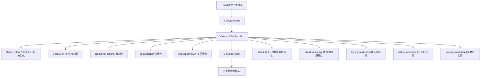

# Mini-OGAS 当前系统架构报告

日期：2026-05-24  
项目路径：`D:\New project\mini-ogas`

## 1. 项目定位

Mini-OGAS 是一个面向研究生复试展示的小型分布式调配与运维系统。当前版本已从“市场分析驱动”调整为更符合 OGAS 思路的“上级调配任务驱动”：

```text
上级调配任务
  -> 汽车零件生产计划
  -> 车间与云节点资源调度
  -> 节点健康监控
  -> AI 辅助诊断与调度解释
  -> 人工权限审批与外部攻击处置
```

系统重点不再是市场预测，而是展示“中央控制、分布式节点协同、健康监控、权限边界、AI 辅助决策、攻击隔离和生产调配”的综合能力。

## 2. 总体架构



### 当前服务分工

| 模块 | 技术 | 端口 | 职责 |
|---|---|---:|---|
| `dashboard` | Vue 3 + TypeScript + Vite + ECharts | 5173 | 前端控制台、节点拓扑、上级任务、资源调度、AI 助手、人工审批 |
| `central-api` | Python 3.12 + FastAPI + Pydantic | 8080 | 中央控制、调配任务、计划生成、节点监控、告警、AI、权限、审计 |
| `node-agent` | Go 1.22 | agent 进程 | 子节点指标采集、心跳、命令轮询、本地脚本、SQLite 写入 |
| `ai-dispatcher` | FastAPI | 8081 | AI 调度微服务预留 |
| `market-simulator` | FastAPI | 8082 | 兼容旧模拟服务，当前主线不依赖市场驱动 |
| `production-planner` | FastAPI | 8083 | 生产计划微服务预留 |
| PostgreSQL | Docker 镜像 | 5432 | 未来中心持久化数据库 |
| Redis | Docker 镜像 | 6379 | 未来缓存/状态服务 |
| NATS | Docker 镜像 | 4222/8222 | 未来消息总线 |

## 3. 当前运行逻辑

### 3.1 上级调配任务

当前核心输入是 `AllocationOrder`，即上级调配中心下发的汽车零件生产任务。

数据字段：

| 字段 | 类型 | 含义 |
|---|---|---|
| `order_id` | string | 调配任务编号，如 `ALLOC-2026-001` |
| `source_unit` | string | 来源单位，默认“上级调配中心” |
| `product_code` | string | 汽车零件编号，如 `A1` |
| `product_name` | string | 汽车零件名称 |
| `required_quantity` | int | 所需数量 |
| `priority` | int | 优先级，1 最高，10 最低 |
| `deadline_hours` | int | 截止时间 |
| `assigned_cloud_role` | string | 云端角色，如“辅助调配”或“数据库管理” |
| `status` | string | 当前状态，默认 `active` |
| `reason` | string | 调配原因 |

相关接口：

| 方法 | 路径 | 作用 |
|---|---|---|
| GET | `/allocation-orders` | 查看当前上级调配任务 |
| POST | `/allocation-orders` | 新增调配任务，并重新生成生产计划 |

### 3.2 汽车零件生产单元

当前产品目录已改为汽车零件，共 15 类：

| 编号 | 零件 |
|---|---|
| A1 | 发动机曲轴 |
| A2 | 凸轮轴 |
| A3 | 变速箱齿轮 |
| A4 | 刹车盘 |
| A5 | 轮毂法兰 |
| A6 | 转向节 |
| A7 | 半轴 |
| A8 | 传动轴叉 |
| A9 | 悬架控制臂 |
| A10 | 活塞销 |
| A11 | 制动钳支架 |
| A12 | 差速器壳体 |
| A13 | 轴承座总成 |
| A14 | 油泵转子 |
| A15 | 安全带卷收器轴 |

每种零件包含：

| 字段 | 含义 |
|---|---|
| `product_name` | 零件名称 |
| `route` | 工艺路线 |
| `base_cycle_time_minutes` | 基准加工周期 |
| `material_cost` | 材料成本 |
| `standard_price` | 标准价格，当前主要用于兼容旧字段 |

工艺路线包括：

| 工序 | 含义 | 主要承接节点 |
|---|---|---|
| `turning` | 车削 | 车削车间 / 云端车削模拟 |
| `milling` | 铣削 | 铣削车间 / 云端铣削模拟 |
| `grinding` | 磨削 | 磨削车间 / 云端磨削模拟 |
| `drilling` | 钻孔 | 铣削能力扩展 |
| `heat_treatment` | 热处理 | 车削能力扩展 |
| `inspection` | 质检 | 磨削/云端质检能力扩展 |

### 3.3 生产计划生成

生产计划由 `generate_production_plan()` 生成。

当前逻辑：

1. 如果开启 `MICROSERVICES_ENABLED=true`，优先请求 `production-planner` 微服务。
2. 如果微服务不可用，回退到本地逻辑。
3. 本地逻辑优先读取 `allocation_orders`。
4. 对每个 `active` 调配任务：
   - 检查工艺路线所需车间是否在线。
   - 如果车间在线，按调配任务数量生成计划。
   - 如果车间不可用，生成保底计划并降低优先级。
5. 生产计划生成后调用 `rebuild_dispatch()` 重新调度设备。

生产计划字段：

| 字段 | 类型 | 含义 |
|---|---|---|
| `product_code` | string | 零件编号 |
| `target_quantity` | int | 目标数量 |
| `priority` | int | 优先级 |
| `route` | list[string] | 工艺路线 |
| `reason` | string | 生成原因，包含上级调配任务说明 |

### 3.4 资源调度

资源调度由 `rebuild_dispatch()` 完成。

逻辑：

1. 遍历所有在线节点的设备。
2. 按设备能力映射工序：
   - Lathe -> `turning`, `heat_treatment`
   - Milling -> `milling`, `drilling`
   - Grinder -> `grinding`, `inspection`
   - Cloud -> `milling`, `drilling`, `inspection`
3. 对每个生产计划的每道工序，选择同工序中负载最低的设备。
4. 找不到设备时生成 `blocked` 任务。
5. 找到设备时生成 `scheduled` 或 `queued` 任务。

调度任务字段：

| 字段 | 含义 |
|---|---|
| `id` | 任务 ID |
| `product_code` / `product_name` | 零件 |
| `route` | 工艺路线 |
| `assigned_node` | 分配节点 |
| `assigned_machine` | 分配设备 |
| `quantity` | 分配数量 |
| `priority` | 优先级 |
| `status` | `scheduled` / `queued` / `blocked` |
| `reason` | 分配原因 |

## 4. 节点设计

### 4.1 中心节点

中心节点运行在本机 Lenovo Y7000P 上，主要职责：

- 接收上级调配任务。
- 生成生产计划。
- 监控节点健康状态。
- 调用 AI 辅助分析。
- 执行权限控制和人工审批。
- 向子节点下发命令。
- 记录告警、事件和审计。

### 4.2 车间节点

| 节点 | 类型 | 作用 |
|---|---|---|
| `turning-workshop-01` | 车削车间 | 曲轴、凸轮轴、半轴、活塞销等车削工序 |
| `milling-workshop-01` | 铣削车间 | 齿轮、转向节、控制臂、支架等铣削/钻孔 |
| `grinding-workshop-01` | 磨削车间 | 精加工、磨削、质检能力 |

### 4.3 云节点

| 节点 | 角色 | 作用 | 权限边界 |
|---|---|---|---|
| `cloud-workshop-01` | 辅助调配 | 承接云端 CNC 仿真、临时排队任务、故障转移产能 | 只能执行低/中风险调度命令，高风险隔离需人工确认 |
| `cloud-db-01` | 数据库管理 | 保存指标、生产追溯、告警、审计摘要 | 只允许数据写入、备份、查询和审计，不允许直接控制设备 |

## 5. 后端结构

目录：`services/central-api/app`

| 文件 | 作用 |
|---|---|
| `main.py` | FastAPI 应用入口，注册 CORS、日志、异常处理、安全中间件和路由 |
| `models.py` | Pydantic 数据模型 |
| `store.py` | 当前核心内存状态、仿真、调度、告警、AI、权限和持久化写入 |
| `core/config.py` | 环境变量配置 |
| `core/database.py` | SQLite 持久化封装 |
| `core/deepseek_client.py` | DeepSeek API 调用与 JSON 解析 |
| `core/security.py` | Token 鉴权与限流 |
| `core/service_client.py` | 标准库 `urllib` 微服务调用 |
| `routers/*.py` | API 路由 |

### 5.1 主要路由

| 路由文件 | 主要接口 |
|---|---|
| `health.py` | `/health`, `/summary` |
| `production.py` | `/allocation-orders`, `/production-plans`, `/inventory`, `/management/snapshot` |
| `dispatch.py` | `/dispatch/tasks`, `/dispatch/resources`, `/dispatch/rebuild` |
| `nodes.py` | `/nodes`, `/metrics`, `/api/nodes/{node}/heartbeat`, `/pending-commands` |
| `ai.py` | `/ai/status`, `/ai/chat`, `/ai/diagnose`, `/ai/shortcuts` |
| `control.py` | `/control/command` |
| `ops.py` | `/ops/pending-approvals`, `/ops/approve`, `/ops/reject`, `/ops/escalations` |
| `simulation.py` | `/simulation/state`, `/simulation/control`, `/simulation/step` |
| `history.py` | `/metrics/history` |
| `transfer.py` | 文件/数据传输测试接口 |

### 5.2 安全与异常处理

当前 `main.py` 已包含：

- CORS 中间件。
- 请求日志：`method`, `path`, `status_code`, `duration_ms`。
- 全局异常处理：
  - `ValueError` -> 400。
  - `RuntimeError` / `Exception` -> 500。
  - `MINI_OGAS_ENV=development` 时显示详细错误。

`security.py` 已包含：

- `X-OGAS-Token` 鉴权。
- `/metrics` 与 `/api/nodes/*` 使用节点上报 token。
- 其他管理接口使用 API token。
- 简单限流。

## 6. 前端结构

目录：`services/dashboard/src`

| 文件/目录 | 作用 |
|---|---|
| `App.vue` | 页面壳、侧边栏、顶部状态栏 |
| `router/index.ts` | Vue Router 页面路由 |
| `api/http.ts` | `fetch` 封装，自动携带 `X-OGAS-Token` |
| `types/domain.ts` | 前端领域类型 |
| `composables/useDashboard.ts` | 全局快照、刷新、命令、AI 和仿真操作 |
| `pages/OverviewPage.vue` | 运行总览 |
| `pages/NodesPage.vue` | 节点拓扑与健康状态 |
| `pages/DispatchPage.vue` | 资源调度与设备负载 |
| `pages/MarketPage.vue` | 当前已调整为“上级任务”页面 |
| `pages/OpsPage.vue` | 运维操作、审批、升级、命令下发 |
| `pages/AiAssistantPage.vue` | AI 运维助手 |
| `pages/CommandsPage.vue` | 命令审计 |
| `components/*.vue` | 图表、卡片、事件流、节点网格等组件 |

### 6.1 当前页面分工

| 页面 | 作用 |
|---|---|
| 运行总览 | 展示节点在线数、告警、阻塞任务、CPU 趋势、事件流、快捷入口 |
| 节点拓扑 | 展示中心节点、车间节点、云节点连接与健康状态 |
| 资源调度 | 展示生产计划、调度任务、设备负载、资源分配 |
| 上级任务 | 创建调配任务、查看汽车零件库存、查看云节点角色和人工权限 |
| 运维操作 | 待审批命令、升级事件、自然语言命令规划 |
| AI 运维助手 | DeepSeek 快捷动作和自由问答 |
| 命令审计 | 命令、告警、事件审计展示 |

## 7. 数据库与数据类型

### 7.1 中心端内存数据

当前主存储是 `MemoryStore`，包含：

| 字段 | 类型 | 说明 |
|---|---|---|
| `nodes` | `dict[str, Node]` | 节点注册表 |
| `metrics` | `list[MetricIn]` | 指标历史 |
| `alerts` | `list[Alert]` | 告警 |
| `production_plans` | `list[ProductionPlanIn]` | 生产计划 |
| `allocation_orders` | `list[AllocationOrder]` | 上级调配任务 |
| `machines` | `list[Machine]` | 设备状态 |
| `dispatch_tasks` | `list[DispatchTask]` | 调度任务 |
| `resource_allocations` | `list[ResourceAllocation]` | 资源聚合 |
| `commands` | `list[NodeCommand]` | 中心下发命令 |
| `incident_events` | `list[IncidentEvent]` | 事件流 |
| `ai_diagnoses` | `list[AiDiagnosis]` | AI 诊断记录 |
| `cloud_roles` | `list[dict]` | 云服务器角色定义 |
| `authority_matrix` | `list[dict]` | 人工权限矩阵 |

### 7.2 中心端 SQLite 持久化

文件：`services/central-api/app/core/database.py`

通过环境变量控制：

```env
PERSIST_ENABLED=false
CENTRAL_DB_PATH=.runtime/central.db
```

默认关闭，开启后写入：

| 表 | 写入来源 |
|---|---|
| `metrics` | `record_metric()` |
| `alerts` | `create_alert()` |
| `ai_diagnosis` | `add_ai_diagnosis()` |
| `commands` | `add_command()` |
| `audit_logs` | `add_event()` |

恢复逻辑：

- 如果数据库已有指标，启动时恢复最近 1000 条 `metrics` 和最近 200 条 `alerts`。
- 如果数据库为空，执行 `seed_demo()` 并写入初始数据。
- 写入失败只打印警告，不阻塞主流程。

### 7.3 节点端 SQLite

Go Node Agent 使用 `modernc.org/sqlite`，本地表：

```sql
node_metrics(
  id,
  collected_at,
  node_code,
  workshop_type,
  cpu_usage,
  memory_usage,
  disk_usage,
  network_in,
  network_out,
  db_latency_ms,
  api_latency_ms,
  finished_quantity,
  defect_quantity
)
```

用途：

- 子节点本地保底记录。
- 中心断联时保存指标。
- 心跳上报 `local_db_size_bytes`，用于中心判断节点本地数据积压。

## 8. AI 设计

DeepSeek 当前定位是“辅助决策”，不是直接控制系统的执行者。

AI 能做：

- 分析节点风险。
- 解释调配计划。
- 对外部攻击给出处置建议。
- 生成复试讲解稿。
- 在复杂故障触发时生成诊断建议。
- 每 20 tick 自动生成健康简报。

AI 不能做：

- 直接隔离节点。
- 直接恢复节点。
- 直接删除或改写审计记录。
- 绕过人工审批执行高风险命令。

相关环境变量：

```env
DEEPSEEK_API_KEY=replace-with-your-key
DEEPSEEK_BASE_URL=https://api.deepseek.com
DEEPSEEK_MODEL=deepseek-v4-flash
AI_ENABLED=true
AI_TIMEOUT_SECONDS=25
```

## 9. 人工权限边界

当前权限矩阵：

| 角色 | 允许 | 禁止 | 是否需要审批 |
|---|---|---|---|
| 上级调配员 | 创建调配任务、调整优先级、查看全局状态 | 直接隔离节点、绕过审批执行高危命令 | 否 |
| 车间操作员 | 查看本车间设备、执行低风险脚本、上报异常 | 修改全局计划、审批高危命令 | 否 |
| AI 辅助决策 | 生成诊断建议、解释调度方案、提出隔离/恢复建议 | 直接执行系统控制、覆盖人工审批 | 是 |
| 系统管理员 | 审批隔离/恢复、处理外部攻击、调整节点权限 | 删除审计记录 | 是 |

控制命令入口：

- `/control/command`：自然语言命令规划和执行。
- `/ops/pending-approvals`：待人工审批命令。
- `/ops/approve/{command_id}`：审批通过。
- `/ops/reject/{command_id}`：拒绝命令。

## 10. 外部攻击处理逻辑

触发条件示例：

- `network_in >= 100_000_000`

处理链路：

```text
异常指标
  -> create_alert(hostile_traffic)
  -> add_event(hostile-detected)
  -> isolate_node()
  -> topology edge 标记 isolated
  -> command/audit 记录
  -> AI 可生成辅助处置建议
  -> 高风险恢复需人工确认
```

## 11. Go Node Agent

目录：`services/node-agent`

主要文件：

| 文件 | 作用 |
|---|---|
| `cmd/node-agent/main.go` | agent 主循环、优雅关闭 |
| `internal/metrics/collector.go` | 指标采集模拟 |
| `internal/localdb/sqlite.go` | 本地 SQLite 写入和关闭 |
| `internal/centralapi/client.go` | HTTP 上报、心跳、命令回传 |
| `internal/heartbeat/heartbeat.go` | 每 5 秒心跳 |
| `internal/commands/executor.go` | 每 10 秒轮询待执行命令 |
| `internal/config/config.go` | 环境变量配置 |

当前能力：

- 周期性采集 CPU、内存、磁盘、网络、DB 延迟、API 延迟、产出和缺陷数。
- 写入本地 SQLite。
- POST 指标到中心端。
- PUT 心跳到中心端。
- 轮询 `/api/nodes/{node_code}/pending-commands`。
- 支持 `clean_temp_cache`，删除 `/tmp/mini-ogas-*.tmp`。
- 收到 `SIGINT/SIGTERM` 后发送 `shutting_down` 心跳并关闭 SQLite。

## 12. 运行方式

### 12.1 本地开发运行

中心端：

```powershell
cd "D:\New project\mini-ogas\services\central-api"
.\.venv\Scripts\python.exe -m uvicorn app.main:app --host 127.0.0.1 --port 8080
```

前端：

```powershell
cd "D:\New project\mini-ogas\services\dashboard"
npm run dev
```

浏览器访问：

```text
http://127.0.0.1:5173
```

Go 节点：

```powershell
cd "D:\New project\mini-ogas\services\node-agent"
$env:NODE_CODE="cloud-workshop-01"
$env:WORKSHOP_TYPE="milling"
$env:CENTRAL_API_URL="http://127.0.0.1:8080"
$env:CENTRAL_API_TOKEN="mini-ogas-dev-token"
$env:LOCAL_DB_PATH="D:\New project\mini-ogas\.runtime\node.db"
& "D:\New project\mini-ogas\.runtime\tools\go\bin\go.exe" run ./cmd/node-agent
```

### 12.2 Docker 运行

Compose 文件：

```text
deploy/docker-compose.central.yml
```

命令：

```powershell
cd "D:\New project\mini-ogas"
docker compose -f deploy/docker-compose.central.yml up --build
```

注意：当前本机环境中 `docker` 命令不可用，之前无法做真实 Docker 校验。

## 13. 测试与验证

当前已验证：

```powershell
cd "D:\New project\mini-ogas\services\central-api"
.\.venv\Scripts\python.exe -m pytest
```

结果：`26 passed`。

```powershell
cd "D:\New project\mini-ogas\services\dashboard"
npm run build
```

结果：构建通过，但主包仍超过 500 KB，有 Vite chunk size warning。

```powershell
cd "D:\New project\mini-ogas\services\node-agent"
$env:GOPATH="D:\New project\mini-ogas\.runtime\go"
$env:GOMODCACHE="D:\New project\mini-ogas\.runtime\go\pkg\mod"
$env:GOCACHE="D:\New project\mini-ogas\.runtime\go-build"
& "D:\New project\mini-ogas\.runtime\tools\go\bin\go.exe" test ./...
```

结果：Go 测试通过。

## 14. 当前不足与后续建议

### 14.1 需要清理的兼容遗留

当前仍保留：

- `market_signals`
- `market_forecast`
- `market-simulator`

这些字段和服务主要用于兼容旧前端、旧测试和微服务结构。展示时应强调系统主线已经改为“上级调配任务”，市场模块不是当前核心。

### 14.2 前端仍有部分旧乱码文案

部分页面曾被错误编码写入，仍可能显示乱码。建议后续统一清理：

- `OverviewPage.vue`
- `NodesPage.vue`
- `DispatchPage.vue`
- `AiAssistantPage.vue`
- `CommandsPage.vue`
- 若干组件文案

### 14.3 前端包体积

当前 ECharts 进入主包，Vite 提示主包超过 500 KB。后续可做：

- 图表组件懒加载。
- `manualChunks` 拆分 `echarts`。
- 页面路由继续懒加载。

### 14.4 数据库生产化

当前中心端默认仍是 MemoryStore，可选 SQLite。后续真正生产化建议：

- SQLModel / SQLAlchemy 接 PostgreSQL。
- 指标写入批处理。
- 审计日志不可篡改。
- 节点注册与发现持久化。

### 14.5 消息总线

当前 NATS 在 Compose 中预留，但主流程仍走 HTTP。后续可把：

- 指标上报
- 告警
- 命令下发
- 生产任务同步

逐步迁移到 NATS subject。

## 15. 复试展示建议

建议按以下顺序展示：

1. 打开“上级任务”页面，下发一个汽车零件调配任务。
2. 查看“资源调度”，说明系统如何按工艺路线把任务分配给车削、铣削、磨削和云端辅助节点。
3. 查看“节点拓扑”，说明中心主机、车间节点、云辅助节点、云数据库节点的职责。
4. 注入普通故障，展示本地脚本优先处理，减少 AI API 压力。
5. 注入复杂故障，展示 AI 诊断和人工审批。
6. 注入外部攻击，展示节点隔离、拓扑变更、事件审计。
7. 打开“运维操作”，说明 AI 不能直接控制系统，高危命令必须人工确认。

一句话总结：

> Mini-OGAS 当前版本以汽车零件生产为对象，通过中心节点接收上级调配任务，协调车间节点和云端辅助节点完成生产计划；系统持续监控节点健康，普通故障由脚本处理，复杂问题由 DeepSeek 辅助诊断，外部攻击触发隔离和审计，高风险动作由人工权限体系兜底。
