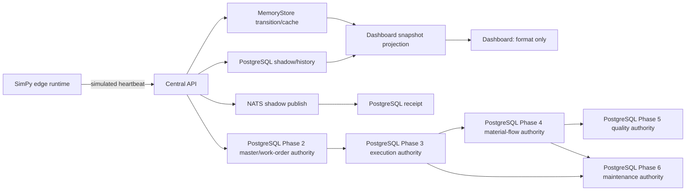

# Source Of Truth Matrix

Last verified: 2026-07-14.

## Definitions

- **Authority**: the component/store whose accepted state wins during conflict.
- **Write path**: the only supported path that may change the authoritative fact.
- **Read projection**: a rebuildable representation used for queries/UI.
- **External owner**: system or accountable role outside Mini-OGAS that owns the original fact.
- **Reconciliation**: deterministic response when authority and projection/external source differ.

`live` is reserved for data read from a governed physical/external source. SimPy/simple output is `simulated`; historical reconstruction is `replay`; scenario overlay/test package is `fixture`; unavailable data is `fallback` or `unknown`. PostgreSQL persistence does not turn simulated data into live data.

## Current Baseline Matrix

| Object | Authority | Write Path | Read Projection | External Owner | Reconciliation |
|---|---|---|---|---|---|
| Node registration | Currently `MemoryStore.nodes`; expected-node config constrains production nodes | Seed/startup and heartbeat registration | Management/dashboard snapshot | Future edge identity registry | Compare configured expected codes, heartbeat identity and DB receipt; reject unknown in production |
| Node heartbeat | Edge simulator payload for current observation; PostgreSQL `heartbeat_shadow` for durable history | Authenticated REST ingest; NATS shadow publish/receipt | `node_heartbeats_v2` cache and dashboard snapshot | Future edge connector/device gateway | Stable node/run/sequence; latest by received/occurred time; quarantine invalid/duplicate payload |
| Runtime source | Runtime producer plus central classifier | Heartbeat runtime fields; central normalizes legacy source by engine | Snapshot `data_source`, node `runtime_source` | Connector/edge owner | SimPy/simple always `simulated`; physical only can be `live`; conflict becomes `mixed`/degraded |
| Run/scenario identity | Edge runtime for active simulation; PostgreSQL `runs`/`scenarios` for history | Simulator start and persistence | Snapshot run block and replay API | Simulation owner; future production execution owner | Reject cross-run aggregation; select latest expected-node receipt; explicit unknown/fallback |
| Simulation clock | Edge runtime | Deterministic epoch + tick + speed | Heartbeat/snapshot | Simulation owner | Compare wall clock/arrival skew; preserve both timestamps; no conversion to plant time |
| Host metrics | Reporting edge process | Heartbeat ingest | Latest metrics cache/snapshot | Host/edge OS | Range validation, freshness timeout, source label |
| Simulated production quantity/rate | SimPy edge for digital-twin measurements; part queue for legacy WIP projection | Heartbeat and part completion paths | Snapshot production block | Future PLC/MES/edge owner | Always simulated; run-scoped sequence/idempotency; never promote to accepted execution quantity |
| Machine master/context | PostgreSQL `equipment` and organization/capability relations govern equipment identity; heartbeat/seed remains runtime context | Authorized master-data API for identity; heartbeat for observed state | Phase 2 API rows plus legacy management/snapshot machine projection | Future CMMS/MES/asset registry | Do not overwrite master identity from telemetry; legacy machine codes require explicit mapping in Phase 3 |
| Organization hierarchy | PostgreSQL `organization_units` | `POST /master-data/organization-units` with strict Enterprise/Site/Area/Line/Cell parent rules | Direct scoped API response; no dashboard projection yet | Enterprise/site owner | Stable code and parent ID; invalid or skipped hierarchy levels fail closed and are audited |
| Equipment capability | PostgreSQL `equipment_capabilities` bound to governed equipment | Authorized capability creation API | Work-order release query | Asset/process owner | Simulator profile is never qualification evidence; release fails if the selected equipment lacks the exact capability |
| Personnel skill/qualification | PostgreSQL `personnel`, `skills`, `personnel_qualifications` | Authorized master-data API; qualification requires validity and evidence reference | Work-order release query | HR/training/process owner | Login account and personnel remain separate; current qualification, level and dates are rechecked at release |
| BOM/Routing/document revision | PostgreSQL parent and revision tables | Draft creation -> approval -> effective transition through authorized APIs | Exact revision IDs on work order and revision query | Engineering/document-control owner | Database triggers block content/identity update and deletion; a partial unique index allows one effective revision per parent |
| Equipment state | Current simulator/node status | Heartbeat, logical isolate/restore | Node/machine cards | Future PLC/SCADA/connector | Current is simulated/logical; future independent readback wins over command acknowledgement |
| Alarm | `alerts` PostgreSQL rows after central rule/ingest creation; current runtime also caches | Rule engine/ingest -> store -> persistence | Active run-filtered alarm queue | Future device alarm source plus MOM rules | Stable alarm identity/run; resolve/close removes active projection but keeps audit/history |
| Rule conclusion | Deterministic rule engine over one snapshot | Read-only evaluation | Snapshot `rule_conclusions` | Rule owner/process engineer | Recompute from same versioned facts; never becomes an equipment fact |
| AI diagnosis/explanation | AI response record as a proposal artifact, not a plant fact | Authorized request -> provider -> schema validation -> `ai_diagnosis` | Alarm detail/audit | AI owner and human approver | Store input references/provider/model/status; on failure expose fallback/error, never fabricate live AI |
| Safety decision | Safety Governor decision record | Authorized control request -> policy review | Audit/control response | Safety/OT policy owner | Decision must match action/target/risk; deny on missing confirmation/role; automation exception remains explicit |
| Command intent | Currently central command state + PostgreSQL `commands`/`command_shadow`; authority is not fully separated | Approved API action -> Command Manager -> persistence | Pending/approval/history projections | Operations/OT owner | Version and transition checks; reconcile DB/cache; ambiguous state is not retried blindly |
| Edge command application | Edge SQLite command ledger | Node polls, validates, persists before/with side effect | Result outbox and heartbeat response | Future equipment connector | Idempotency key prevents re-execution; expired/unsupported commands fail |
| Command result | Edge result outbox for delivery, central command record for accepted status | Durable edge POST retry -> central transition | Command/audit UI | Command owner | Query by command/idempotency key; missing receipt becomes inconclusive, not assumed failed/successful |
| Command effect | Current verifier over later simulated heartbeat | Observation window after `set_target_rate` | Verification evidence/status | Future physical connector readback | Baseline/observations required; timeout/mismatch stays partial/failed/inconclusive |
| Part queue | `MemoryStore.part_queue` and `part_queue_shadow` remain simulation/compatibility projection only | Dispatch seed/release -> claim -> simulated downstream part | Legacy queue/WIP projection | Simulation owner | Never map to Phase 4 stock or genealogy without an explicit reviewed adapter |
| Production plan | Planner/central record with PostgreSQL `production_plan_shadow` | Planner rules over simulated market/capacity -> central write | Plan and dispatch view | Future ERP/APS/business owner | Source order/version; external owner wins on accepted business plan; derived plan can be rebuilt |
| Dispatch task | Central dispatch state with PostgreSQL `dispatch_task_shadow` | Plan conversion and approval transitions | Work-order/dispatch view | MOM operations owner | State-machine transition and audit; unknown completion remains null |
| Allocation order | Central record + `allocation_order_shadow` | Seed/API allocation | Management/order view | Future ERP/customer order owner | External-ID mapping and status/version comparison |
| Work-order master release | PostgreSQL `work_orders` for exact product, BOM, Routing, document, calendar, shift and assignment binding | Draft creation -> release after effective-version, equipment-capability and personnel-qualification validation | Phase 2 API response; legacy dispatch dashboard is not this authority | MOM operations owner | Release is idempotent and transactionally audited; Phase 3 references the immutable released binding |
| Production Order | PostgreSQL `production_orders` and attachment relation | Authorized create -> attach exact released Work Orders -> release -> derived progress/completion -> close | `/execution/production-orders/*` response | Production-control owner | Product and exact quantity match; strict status; validation records remain engineering test data |
| Work Order execution | PostgreSQL `work_order_execution` bound to Phase 2 `work_orders` | Dispatch -> operation-derived in-progress/completed -> explicit close | `/execution/work-orders/*` query/replay | MOM operations owner | Cannot dispatch unreleased/unattached work; no legacy dispatch string is accepted as authority |
| Operation Task/assignment/setup | PostgreSQL Phase 3 operation tables | Dispatch exact Routing operation -> setup -> start/pause/resume/hold/downtime/complete/close | Task query and Work Order replay | Operations/process owner | Database and application state guards; exact released equipment/personnel assignment; setup evidence required |
| Accepted operation quantity | PostgreSQL `operation_quantity_reports` | Authorized idempotent report with evidence while task runs/pauses | Task totals and replay | Operations/quality owner | Append-only; report ID uniqueness; row-locked DB trigger prevents over-plan; exact total required for completion |
| Operation status history | PostgreSQL `operation_status_history` | Every accepted task transition in same transaction | Task history and Work Order replay | Compliance/operations owner | Update/delete blocked; ordered occurrence/id reconstructs the accepted state path |
| Operation hold/downtime | PostgreSQL hold and downtime ledgers plus guarded task state | Authorized hold/release or downtime start/end | Work Order replay | Operations/maintenance owner | One open record per task; durable reason/evidence; release/end restores legal state |
| Market signal | Random `market-simulator`/seed in current baseline | Simulator endpoint/integration refresh | Management/planner input | Future ERP/demand source | Always label simulation; Production rejects demo source or leaves unavailable |
| Inventory/WIP balance | PostgreSQL `inventory_balances`, changed transactionally with accepted Phase 4 movement | Authorized `/material-flow/movements`, transformation legs, or approved reconciliation adjustment | Lot balance query; future inventory workbench | Inventory control owner | Nonnegative DB check; Lot/Location/Container key; direct snapshot or browser overwrite forbidden |
| Lot/Serial and genealogy | PostgreSQL `material_lots`, immutable movements, transformations, and genealogy edges | Governed identity create plus accepted material transaction | Recursive ancestors/descendants and balance query | Inventory/quality owner | Serial global quantity <= 1; conservation, acyclic graph, immutable evidence |
| External inventory observation | PostgreSQL immutable `external_inventory_imports`; external claim is not stock authority | Versioned simulated ERP/WMS snapshot import | Reconciliation cases | Future ERP/WMS owner; current simulator owner | Full payload/hash/idempotency; difference opens case and never silently overwrites balance |
| Inventory reconciliation | PostgreSQL reconciliation case plus compensating movement | Authorized still-current adjustment with reason/evidence | Case response and audit log | Inventory control owner | Reject stale/resolved case; preserve original and adjustment evidence separately |
| Inspection plan/specification | PostgreSQL `inspection_plans` and immutable `quality_characteristics` | Quality definition -> approval -> effectivity | `/quality/inspection-plans/*` response | Quality/process engineering owner | Exact Material/stage/revision; one effective plan; specification and sampling evidence cannot be rewritten |
| Gauge and measurement | PostgreSQL `gauges` and append-only `quality_measurements` | Qualified inspector records one typed sample against an effective Characteristic | Inspection Lot query | Metrology/quality owner | UOM, method, Gauge type/calibration period, person qualification and deterministic result are required |
| Quality Hold/NC/disposition/release | PostgreSQL Inspection Lot, Hold, NC, disposition and status history | Open inspection places Hold; sample evaluates; authorized disposition/release resolves | Inspection query; Phase 4 movement gate | Quality authority | Open Hold blocks material flow; Failed requires approved use-as-is; AI has no release authority |
| Quality CAPA | PostgreSQL `capa_records` | Authorized root-cause/action record -> verified effectiveness completion | CAPA response and audit | Quality/compliance owner | Completion requires verification reference and effectiveness result; no AI auto-close |
| Maintenance Asset/Request/Order | PostgreSQL Phase 6 Asset, Request, Order, Checklist and status tables | Governed request -> approval -> work/checks -> independent verification | `/maintenance/*` responses; future maintenance projection | Maintenance/equipment owner | Alarm is source only; Work completed still blocks production until independent verification; evidence is immutable |
| Preventive maintenance | PostgreSQL `preventive_maintenance_plans` | Authorized Plan effectivity and due generation | Due Request/Order response | Maintenance planner | Generation creates due work and advances due time; never claims execution or restoration |
| Tool life and calibration | PostgreSQL Tool, assignment, life and Calibration tables | Append-only usage/calibration events against governed Tool/Task | Tool response; Operation Task readiness guard | Tooling/metrology owner | Over-life or invalid/expired calibration blocks task; simulated heartbeat wear is not authority |
| Maintenance spare use | Phase 4 movement/balance owns quantity; Phase 6 spare relation owns purpose | Maintenance-authorized Consume -> immutable Order relation | Order/spare response and inventory query | Inventory and maintenance owners | Consume has exactly one Operation Task or Maintenance Order authority; same Order must own spare link |
| Audit log | PostgreSQL `audit_logs` plus event records | Every protected action/result -> append; Phase 2/3/4/5/6 mutation also enqueues a NATS audit envelope in the same transaction | Log management and incident timeline | Compliance owner | Actor/scope/action/result/detail are durable; Outbox failure rolls the business mutation back |
| Event store | PostgreSQL `event_store` for recorded events | Central event recording/NATS shadow worker | Timeline/replay | Domain owner per event type | Unique ID and `(source, run, local sequence)`; PostgreSQL transaction serializes/rebases overlapping writers; deterministic projection rebuild still required |
| NATS receipt | PostgreSQL `nats_shadow_receipts` | Shadow consumer acknowledgement | Integration health | Platform owner | Match message ID/subject/sequence; current receipt proves transport only |
| User/password/role | PostgreSQL `users`, `roles`, `user_roles`, `role_permissions` | Bootstrap once, then authenticated admin path | JWT claims/session | Identity/security owner | Database active state and role links win; role does not prove personnel qualification; token revocation design remains limited |
| Tenant/site scope | PostgreSQL columns plus forced RLS on 18 Phase 1, 18 Phase 2, 11 Phase 3, 10 Phase 4, 10 Phase 5, and 14 Phase 6 tables | Scoped application role and session settings | Scoped API/database reads | Security/data owner | Non-superuser/no-BYPASSRLS role and live alternate-site probes pass; all 81 accepted tables are forced-RLS scoped |
| Secret | Environment/vault file during current local runtime | Provisioning/unlock workflow | Redacted status only | Security owner/provider | Never return secret; ACL/rotation check; revoke on suspected exposure |
| Dashboard presentation | No fact authority | Reads API and formats values | Browser DOM | Product/UI owner | No KPI/due/status generation; null is `未上报`; provenance stays visible |

## Current Authority Conflicts

1. `MemoryStore` and PostgreSQL shadow tables both participate in command, queue, alert and plan state. The database is durable history, but in-process mutation often occurs first.
2. Machine/work-order context combines seed records with heartbeat values.
3. `event_store` and business/shadow tables can contain representations of the same transition without a documented projection checkpoint.
4. NATS and REST are both active, but NATS is explicitly shadow and cannot be treated as command/event authority.
5. Phase 3 binds governed Phase 2 IDs, but legacy seeded machine/plan/dispatch projections are not reconciled to Phase 3 execution IDs; they remain separate compatibility facts.
6. Legacy inventory cards and part-queue projections are not mapped to Phase 4 movement, balance, or genealogy facts and must remain visibly simulated.
7. Phase 4 simulated ERP/WMS observations prove the reconciliation contract only; no external system ownership or physical inventory accuracy is established.
8. Phase 5 Gauge and measurement records are governed software facts, but no physical
   Gauge/CMM/LIMS source or electronic-signature owner is connected.
9. Phase 6 Asset state, Tool life and Calibration records are governed software
   facts, but no CMMS/EAM, physical condition source, preset counter, calibration
   laboratory or independent equipment readback is connected.

Until those conflicts are removed, a response must expose provenance and a degraded/mixed state rather than silently choosing the most convenient value.

## Canonical Read Path

This diagram describes the current compatibility chain, not the target architecture. Target state removes memory as transactional authority and makes projections rebuildable from declared PostgreSQL/event authorities.

## Reconciliation Requirements For The Next Phases

- Phase 7 must define Historian/raw telemetry authority, retention tiers, canonical
  event/query models, projection checkpoints, lag/staleness, rebuild and replay
  without promoting simulated telemetry into plant truth.
- Every consumer records its projection checkpoint and handles duplicates/out-of-order input.
- Missing facts remain null/unknown; defaults are configuration facts only when explicitly identified.
- Each state machine defines legal transitions and a compensating/manual path.
- External ERP/SCADA/PLC facts require external-ID mapping and ownership rules before import.
- Dashboard and AI receive a source, freshness and quality marker with every decision-relevant value.
