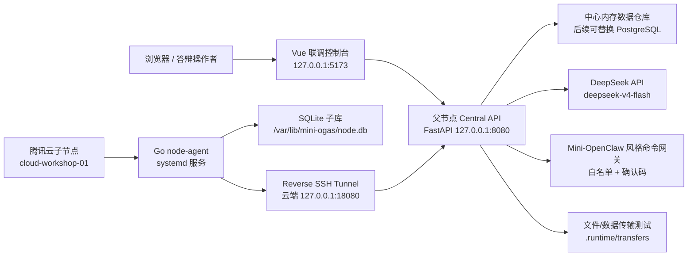

# Mini-OGAS 分布式系统现状与架构报告

生成日期：2026-05-22  
项目目录：`D:\New project\mini-ogas`  
报告范围：本机父节点、腾讯云子节点、前端联调控制台、DeepSeek 接入、命令网关、数据/文件传输测试、当前运行状态与后续计划。

## 1. 项目定位

Mini-OGAS 是一个面向研究生复试/面试展示的小型分布式机械厂管理系统。系统模拟通用机械加工场景，包括车削、铣削、磨削车间节点，展示父节点集中调度、子节点指标上报、异常检测、脚本自愈、AI 诊断、节点隔离/恢复、数据传输和自然语言控制命令转发能力。

项目重点不是追求生产级规模，而是展示：

- 分布式父子节点架构；
- 低配云服务器可运行的轻量节点；
- 运行指标可视化；
- 异常发现、隔离、恢复闭环；
- DeepSeek API 辅助诊断；
- 类 OpenClaw 的自然语言命令网关；
- 文件/数据传输校验；
- 后续可扩展到多台云服务器。

## 2. 当前硬件与节点规划

### 2.1 已接入节点

| 节点 | 角色 | 当前用途 | 部署位置 | 状态 |
| --- | --- | --- | --- | --- |
| 本机 Lenovo Y7000P | 父节点/中心控制节点 | 前端、Central API、DeepSeek 调用、命令网关、报告和总控 | 本地 D 盘项目目录 | 代码完成，当前进程未运行 |
| 腾讯云 Lighthouse Ubuntu | 子节点 | `cloud-workshop-01`，云端铣削车间节点，运行 Go node-agent + SQLite 子库 | 公网服务器 `82.156.217.166` | 已完成部署，需启动本机反向通道后联调 |

### 2.2 推荐扩展

推荐再增加 1 台云服务器即可，总计 2 台云服务器：

- `cloud-workshop-01`：铣削车间；
- `cloud-workshop-02`：车削或磨削车间。

3 台云服务器可以做到车削/铣削/磨削各一台，但对复试展示不是必须。

## 3. 总体架构



## 4. 已完成操作汇总

### 4.1 本机工程搭建

- 在 `D:\New project\mini-ogas` 建立项目目录；
- 建立前后端、节点 agent、部署脚本、文档目录；
- 配置 Python、Node.js、Go 编译环境；
- 添加 VS Code 工作区文件；
- 添加基础文档：架构、数据库、权限、故障处理、市场生产、开发环境等。

### 4.2 后端 Central API

后端位于：

`D:\New project\mini-ogas\services\central-api`

使用技术：

- FastAPI；
- Pydantic；
- 内存数据仓库；
- REST API；
- DeepSeek OpenAI-compatible HTTP 调用；
- 轻量传输测试接口；
- 命令网关接口。

已完成模块：

- 健康状态：`/health`、`/summary`、`/hosts/status`
- 节点管理：`/nodes`、`/metrics/latest`、`/metrics`
- 节点隔离/恢复：`/nodes/{node_code}/isolate`、`/nodes/{node_code}/restore`
- 生产与市场：库存、市场信号、生产计划；
- 异常审计：告警、命令、事件、审计日志；
- 实时模拟：启动、暂停、单步推进；
- 文件/数据传输测试；
- DeepSeek 诊断和聊天；
- 自然语言控制命令网关。

### 4.3 云服务器子节点

云端子节点已完成：

- Ubuntu 环境配置；
- Go node-agent 编译与部署；
- systemd 服务 `mini-ogas-node-agent`；
- SQLite 子库 `/var/lib/mini-ogas/node.db`；
- 指标采集与本地写入；
- 通过反向 SSH 隧道向本机父节点上报；
- 节点命名为 `cloud-workshop-01`；
- 车间类型配置为铣削车间。

云端主要文件：

- `/opt/mini-ogas/node-agent/node-agent`
- `/etc/mini-ogas/node-agent.env`
- `/var/lib/mini-ogas/node.db`
- systemd 服务：`mini-ogas-node-agent`

### 4.4 反向通道

已实现：

- 云端 `127.0.0.1:18080` 转发到本机 `127.0.0.1:8080`；
- 使用 Paramiko 脚本维护 reverse tunnel；
- 脚本位置：`tools/cloud_reverse_tunnel.py`。

用途：

- 云服务器无需直接访问本机公网；
- 子节点通过云端本地端口访问父节点 API；
- 适合学生本地电脑 + 云服务器混合部署。

### 4.5 前端联调控制台

前端位于：

`D:\New project\mini-ogas\services\dashboard`

当前前端已被重构为“父节点/子节点联调控制台”，重点展示：

- 父节点状态；
- 子节点状态；
- Reverse SSH Tunnel 状态；
- CPU/内存/磁盘/API 延迟；
- 拓扑链路；
- 可点击测试命令；
- 命令输出；
- DeepSeek 独立聊天框；
- 自然语言控制系统。

前端入口：

`http://127.0.0.1:5173/`

## 5. DeepSeek API 接入现状

### 5.1 当前配置

DeepSeek 配置写入项目根目录 `.env`，但报告中不展示 API Key 原文。

当前检测到：

- `DEEPSEEK_API_KEY`：已配置，长度 35；
- `DEEPSEEK_BASE_URL=https://api.deepseek.com`
- `DEEPSEEK_MODEL=deepseek-v4-flash`
- `AI_ENABLED=true`

### 5.2 已实现接口

| 接口 | 作用 |
| --- | --- |
| `GET /api/ai/status` | 检查 DeepSeek 是否启用、Key 是否配置、模型和工作模式 |
| `POST /api/ai/diagnose` | 将节点指标、告警和问题发送给 DeepSeek，生成诊断记录 |
| `POST /api/ai/chat` | 独立 AI 聊天框接口，用于询问系统问题和复试话术 |

### 5.3 已验证结果

此前已验证：

- `GET /api/ai/status` 返回 `configured=true`；
- `mode=deepseek-live`；
- `POST /api/ai/diagnose` 返回 `used_deepseek=true`；
- `POST /api/ai/chat` 返回 `used_deepseek=true`。

说明：当前报告生成时，本机服务进程未运行，因此实时接口不可访问；代码和配置仍保留。

## 6. Mini-OpenClaw 风格命令网关

### 6.1 设计目标

用户提出希望 AI 不只是回答问题，还能控制整个系统。因此已新增“自然语言命令网关”，类似 OpenClaw 思路：

自然语言输入 -> AI/关键词解析 -> 白名单动作计划 -> 风险检查 -> 低危直接执行/高危确认后执行 -> 写入事件和审计。

### 6.2 安全策略

不允许 AI 直接执行任意系统命令。当前只允许白名单动作：

- `refresh_status`
- `restore_node`
- `isolate_node`
- `simulate_common_fault`
- `simulate_complex_fault`
- `simulate_hostile_attack`
- `generate_plan`

高危动作：

- `isolate_node`
- `simulate_hostile_attack`

高危动作必须提供确认码：

`CONFIRM`

### 6.3 已实现接口

`POST /api/control/command`

请求示例：

```json
{
  "text": "恢复云端子节点并刷新状态",
  "execute": true,
  "confirm": null,
  "actor": "dashboard-operator"
}
```

高危请求示例：

```json
{
  "text": "隔离云端子节点",
  "execute": true,
  "confirm": "CONFIRM",
  "actor": "dashboard-operator"
}
```

### 6.4 前端展示

前端已新增“自然语言控制系统”面板：

- 输入自然语言命令；
- 点击“解析计划”；
- 点击“转发执行”；
- 高危命令输入确认码；
- 展示动作、目标节点、风险等级、执行结果。

## 7. 文件/数据传输测试

### 7.1 已实现接口

| 接口 | 作用 |
| --- | --- |
| `POST /api/transfer/data-test` | 前端生成 JSON 指标数据包，后端计算大小和 SHA-256，并保存 |
| `POST /api/transfer/file-test` | 前端生成测试文件内容，Base64 传输，后端落盘校验 |

### 7.2 保存位置

`D:\New project\mini-ogas\.runtime\transfers`

### 7.3 已验证能力

此前已验证：

- 数据包可成功传输；
- 文件可成功传输；
- 返回 `bytes_received`；
- 返回 `checksum_sha256`；
- 能显示保存路径。

当前阶段这是“前端 -> 父节点”的传输测试。后续可升级为“父节点 -> 云端子节点”的真实下发测试。

## 8. 当前运行状态

报告生成前检查结果：

| 进程 | 状态 |
| --- | --- |
| `central-api` | 未运行 |
| `dashboard` | 未运行 |
| `reverse-tunnel` | 未运行 |

原因：上一次操作被用户中断后，相关本地进程已停止或 PID 失效。

### 8.1 启动 Central API

```powershell
$Root=(Resolve-Path 'D:\New project\mini-ogas').Path
$Python=Join-Path $Root 'services\central-api\.venv\Scripts\python.exe'
$ApiDir=Join-Path $Root 'services\central-api'
Start-Process -FilePath $Python -ArgumentList @('-m','uvicorn','app.main:app','--host','127.0.0.1','--port','8080') -WorkingDirectory $ApiDir -WindowStyle Hidden
```

### 8.2 启动前端

```powershell
cd 'D:\New project\mini-ogas\services\dashboard'
npm run dev -- --host 127.0.0.1 --port 5173
```

### 8.3 启动反向隧道

需要确保 SSH 环境变量已配置，然后运行：

```powershell
cd 'D:\New project\mini-ogas'
.\services\central-api\.venv\Scripts\python.exe tools\cloud_reverse_tunnel.py
```

注意：不要在报告或公开材料中展示服务器密码和 DeepSeek API Key。

## 9. 关键目录结构

```text
D:\New project\mini-ogas
├─ services
│  ├─ central-api
│  │  └─ app
│  │     ├─ core
│  │     │  ├─ config.py
│  │     │  └─ deepseek_client.py
│  │     ├─ routers
│  │     │  ├─ ai.py
│  │     │  ├─ control.py
│  │     │  ├─ health.py
│  │     │  ├─ nodes.py
│  │     │  ├─ simulation.py
│  │     │  └─ transfer.py
│  │     ├─ models.py
│  │     └─ store.py
│  ├─ dashboard
│  │  └─ src
│  │     ├─ App.vue
│  │     ├─ style.css
│  │     └─ api/http.ts
│  └─ node-agent
│     └─ cmd/node-agent
├─ deploy
│  └─ cloud-node
├─ tools
│  ├─ deploy_cloud_node_ssh.py
│  └─ cloud_reverse_tunnel.py
├─ scripts
│  ├─ verify-dev.ps1
│  └─ package-cloud-node.ps1
├─ docs
└─ .runtime
```

## 10. 主要接口清单

### 系统状态

- `GET /health`
- `GET /summary`
- `GET /hosts/status`

### 节点与指标

- `GET /nodes`
- `GET /metrics/latest`
- `POST /metrics`
- `POST /nodes/{node_code}/isolate`
- `POST /nodes/{node_code}/restore`

### DeepSeek

- `GET /ai/status`
- `POST /ai/diagnose`
- `POST /ai/chat`
- `GET /ai-diagnoses`

### 命令网关

- `POST /control/command`

### 文件/数据传输

- `POST /transfer/data-test`
- `POST /transfer/file-test`

### 仿真

- `GET /simulation/state`
- `POST /simulation/control`
- `POST /simulation/step`

## 11. 当前风险与注意事项

1. DeepSeek API Key 已经在聊天中出现过，正式展示前建议去 DeepSeek 控制台废弃旧 Key，并重新生成。
2. 云服务器登录密码也曾经出现在截图中，建议修改密码或切换 SSH Key 登录。
3. 当前命令网关是受控白名单版本，不允许任意 shell 命令，这是正确方向；后续如果接入真实生产命令，需要更严格的权限、审计和回滚。
4. 当前中心数据仓库仍是内存存储，重启会丢失运行记录；后续建议接 PostgreSQL 或 SQLite 中心库。
5. 当前文件/数据传输测试主要落在父节点，本地保存；后续可扩展到真正下发云端 agent。
6. 本报告生成时服务未运行，演示前需要按第 8 节启动。

## 12. 后续建议

### 12.1 近期必须做

- 重新启动 Central API、Dashboard、Reverse Tunnel；
- 打开前端检查：
  - 父子节点状态；
  - DeepSeek 聊天框；
  - 自然语言控制系统；
  - 数据/文件传输测试；
- 如果新买第二台云服务器，将其配置为 `cloud-workshop-02`。

### 12.2 展示增强

- 给命令网关增加“命令执行时间线”；
- 给 DeepSeek 诊断增加“采纳建议/人工修正/生成报告”；
- 将文件传输升级为父节点下发到云端子节点；
- 增加第二台云服务器节点拓扑；
- 增加 PowerBI 或报表导出页面。

### 12.3 工程化增强

- 中心数据库持久化；
- 用户权限与登录；
- 审批流；
- 命令签名和确认码；
- 节点 token 鉴权；
- Docker Compose 一键启动；
- 云端 agent 自动注册和远程升级。

## 13. 复试答辩话术摘要

本系统采用本机父节点 + 云端子节点的轻量分布式架构。父节点负责统一调度、指标汇聚、AI 诊断、命令审批和前端展示；云端子节点负责模拟车间采集、SQLite 本地缓存和指标上报。系统在低配云服务器上运行轻量 Go agent，避免把复杂服务部署到云端，从而降低成本。

异常处理采用分级策略：普通问题优先由脚本处理，复杂问题调用 DeepSeek 辅助诊断，重大子节点问题执行隔离以保护整体系统，威胁全局的问题进入高危审批和停机流程。新增的命令网关模拟 OpenClaw 思路，将自然语言转换为白名单命令，并对高危动作要求确认码，体现了 AI 可控、可审计、不可越权的工程设计。

## 14. 结论

Mini-OGAS 当前已经具备复试展示所需的核心能力：

- 分布式父子节点；
- 云端子节点采集；
- 前端状态可视化；
- DeepSeek API 接入；
- 独立 AI 聊天框；
- 自然语言命令网关；
- 节点隔离和恢复；
- 数据/文件传输测试；
- 低配云服务器可运行架构。

当前主要缺口不是代码框架，而是演示前需要重新拉起本机 API、前端和反向隧道，并在第二台云服务器购买后接入 `cloud-workshop-02`。
