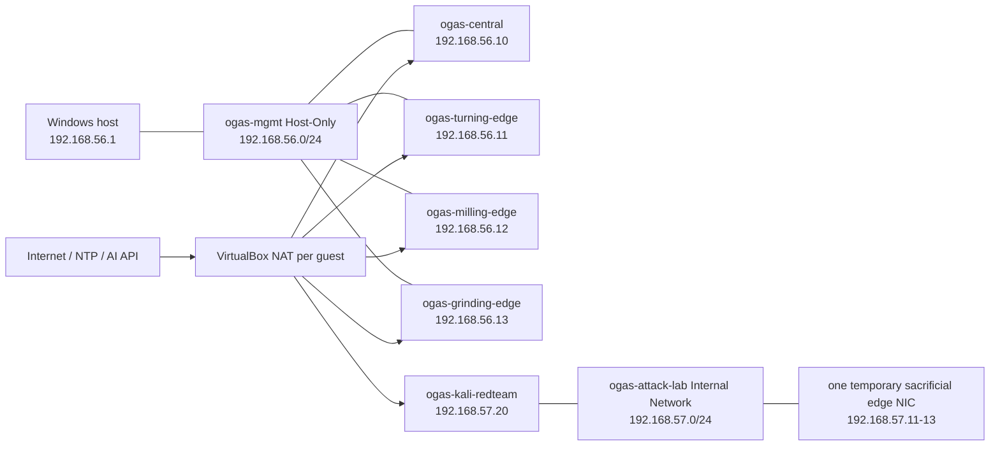

# Mini-OGAS v3.0 Network Profile

> Profile ID: `OGAS-NET-V3-LAB-01`
> Status: frozen target; current discrepancies are listed in Section 10

## 1. Design goals

The network separates management/event traffic, Internet egress, and authorized attack-lab traffic. No production service is exposed directly to the public Internet. The host can administer the lab, edges can initiate traffic to Central, and the attack VM cannot route to Central.

## 2. Topology



There is no route from `ogas-attack-lab` to `ogas-mgmt`. The temporary target NIC is removed after the approved test window.

## 3. Networks

| Network | VirtualBox type | CIDR | Mask | Gateway | DHCP | Purpose |
|---|---|---|---|---|---|---|
| guest NAT | NAT per VM | VirtualBox-managed | VirtualBox-managed | VirtualBox-managed | internal | outbound package, NTP, and approved API access |
| `ogas-mgmt` | Host-Only | `192.168.56.0/24` | `255.255.255.0` | none | disabled | host, Central, and production-edge control plane |
| `ogas-attack-lab` | Internal Network | `192.168.57.0/24` | `255.255.255.0` | none | disabled | isolated authorized attack tests |
| physical LAN | host Wi-Fi/Ethernet | site-assigned | site-assigned | site router | site-managed | host Internet only; guests do not bridge by default |

No default gateway is configured on Host-Only or Internal Network NICs. Each guest has exactly one default route, through its NAT NIC.

## 4. Address allocation

### 4.1 Management network

| Address | Identity | Allocation |
|---|---|---|
| `192.168.56.1` | Windows host | static |
| `192.168.56.10` | `ogas-central` | static |
| `192.168.56.11` | `ogas-turning-edge` | static |
| `192.168.56.12` | `ogas-milling-edge` | static |
| `192.168.56.13` | `ogas-grinding-edge` | static |
| `192.168.56.20-29` | reserved observability/services | unused in v3.0.0 |
| `192.168.56.100-199` | future temporary guests | manual reservation only |

### 4.2 Attack-lab network

| Address | Identity | Allocation |
|---|---|---|
| `192.168.57.20` | `ogas-kali-redteam` | static |
| `192.168.57.11` | temporary turning target NIC | only during approved test |
| `192.168.57.12` | temporary milling target NIC | only during approved test |
| `192.168.57.13` | temporary grinding target NIC | only during approved test |

## 5. Name resolution

During the single-host lab phase, each VM MUST have the following entries in `/etc/hosts`:

```text
192.168.56.10 ogas-central
192.168.56.11 ogas-turning-edge
192.168.56.12 ogas-milling-edge
192.168.56.13 ogas-grinding-edge
```

Certificates use these canonical names. A later DNS service may replace host files only after forward and reverse resolution tests pass.

## 6. NAT and DNAT rules

NAT provides guest egress. Inbound forwarding binds to `127.0.0.1` so it is not reachable from the physical LAN.

| Host bind | Guest | Guest target | State |
|---|---|---|---|
| `127.0.0.1:2220/tcp` | `ogas-central` | `22/tcp` | required after Central moves to NAT + Host-Only |
| `127.0.0.1:2221/tcp` | `ogas-turning-edge` | `22/tcp` | existing |
| `127.0.0.1:2222/tcp` | `ogas-milling-edge` | `22/tcp` | existing |
| `127.0.0.1:2223/tcp` | `ogas-grinding-edge` | `22/tcp` | existing |
| `127.0.0.1:2224/tcp` | `ogas-kali-redteam` | `22/tcp` | existing |

There is no DNAT for PostgreSQL, Redis, NATS, Central API, dashboard, or NATS monitoring. The host accesses these through `ogas-mgmt`. Temporary debugging forwards require an issue ID, expiry time, and audit entry.

## 7. Firewall allowlist

Default policy is deny inbound and allow established return traffic.

### 7.1 Central inbound

| Source | Destination port | Protocol | Decision |
|---|---:|---|---|
| `192.168.56.1` | 22, 5173, 8080 | TCP | allow |
| `192.168.56.1` | 4222 | TCP | allow only for local verification client |
| `192.168.56.11-13` | 8080, 4222 | TCP | allow with valid credential/mTLS |
| any management address | 5432, 6379, 8081-8083, 8222, 9099 | TCP | deny; loopback only |
| `192.168.57.0/24` | any | any | deny |
| physical LAN and Internet | any | any | deny |

### 7.2 Edge inbound

| Source | Destination port | Decision |
|---|---:|---|
| `192.168.56.1` | 22/tcp | allow |
| `192.168.56.10` | ICMP echo | allow for health diagnostics |
| all other management traffic | any | deny |

Edges initiate REST/NATS sessions; Central does not require an inbound edge-agent port.

### 7.3 Edge outbound

| Destination | Port | Decision |
|---|---:|---|
| `192.168.56.10` | 8080, 4222 | allow |
| approved NTP servers | 123/udp | allow through NAT |
| approved Ubuntu repositories | 80/443 | allow during maintenance window |
| any PostgreSQL/Redis destination | 5432/6379 | deny |
| other management nodes | any | deny |

## 8. Blacklist rules

Packets are dropped and counted when they match any of these rules:

- source address spoofed as another management node on the wrong interface;
- attack-lab source attempting to reach `192.168.56.0/24`;
- wildcard scan across Central ports;
- repeated failed TLS or token authentication above 10 attempts per minute;
- edge-to-edge connection attempts;
- any physical-LAN request to guest service ports;
- any outbound connection from an edge to a non-allowlisted database or message broker.

A blacklist decision creates a security event; it does not automatically execute a destructive response.

## 9. NATS network profile

### 9.1 v3.0.1 loopback profile

```text
client:  127.0.0.1:4222
monitor: 127.0.0.1:8222
cluster: disabled
TLS:     loopback exception only
```

### 9.2 Edge-ready profile

```text
client:  192.168.56.10:4222
monitor: 127.0.0.1:8222
cluster: disabled
TLS:     required, mutual authentication
```

The NATS listener MUST NOT bind to `0.0.0.0`. Monitoring MUST remain loopback-only. JetStream storage stays on Central local disk.

## 10. Audited current-state discrepancies

These facts were observed on 2026-07-13 and are not silently treated as compliant:

| Item | Current fact | Contract target | Gate |
|---|---|---|---|
| Host-Only address | `169.254.173.15/16` | `192.168.56.1/24` | fix before v3.0.3 |
| Host-Only DHCP | enabled | disabled | fix before v3.0.3 |
| production edge NICs | NAT only | NAT + Host-Only | fix before v3.0.3 |
| Central NICs | bridged + Host-Only | NAT + Host-Only | fix before v3.0.3 |
| recorded host Wi-Fi | docs say `.4`; live is `.6` | physical address is non-contractual | replace stale reference |
| VM states | powered off/saved | explicit selected run profile | verify during migration |
| Kali strict-check view | verifier said not registered while VBox inventory lists it | one consistent `VBOX_USER_HOME` | fix before attack-lab gate |

## 11. Network preflight commands

Representative Windows checks:

```powershell
Get-NetIPAddress -AddressFamily IPv4
Get-NetTCPConnection -State Listen
& 'C:\Program Files\Oracle\VirtualBox\VBoxManage.exe' list hostonlyifs
& 'C:\Program Files\Oracle\VirtualBox\VBoxManage.exe' list vms
& 'C:\Program Files\Oracle\VirtualBox\VBoxManage.exe' list runningvms
Test-NetConnection 192.168.56.10 -Port 8080
Test-NetConnection 192.168.56.10 -Port 4222
```

Representative Linux guest checks:

```bash
ip -brief address
ip route
getent hosts ogas-central
chronyc tracking
curl --fail --max-time 5 http://ogas-central:8080/health
openssl s_client -connect ogas-central:4222 -CAfile /etc/mini-ogas/ca.crt
```

Evidence MUST record addresses, routes, certificate identity, and pass/fail without recording tokens.

## 12. Rollback

Network rollback removes temporary forwards and attack-lab NICs, restores the last exported VirtualBox VM configuration, and returns services to loopback process mode. It MUST NOT enable bridged access as an emergency shortcut. REST health and a fresh process-mode heartbeat are the minimum rollback proof.
