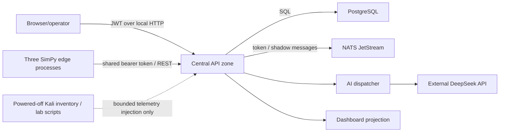

# Mini-OGAS Threat Model

## Scope And Security Posture

This threat model covers the 2026-07-14 single-host digital-twin baseline and the trust changes required before a real pilot. There is currently no physical equipment connector or write path. Absence of a connector contains some OT risks but does not close them for future Production.

## Protected Assets

1. Administrator/operator identities and JWT signing material.
2. Node ingest and NATS credentials.
3. Encrypted AI provider vault and unlock state.
4. PostgreSQL business, command, alarm, audit and event records.
5. Edge SQLite part/command/result records.
6. Command intent, approval, execution and verification evidence.
7. Simulation and future production source provenance.
8. Future PLC/CNC/SCADA endpoints, certificates, tag mappings and safe envelopes.
9. Security-lab isolation and target allowlists.
10. Operator trust in alarms, status and remediation outcomes.

## Actors

| Actor | Expected privilege | Primary concern |
|---|---|---|
| Viewer | Read approved site facts | Data leakage/cross-scope access |
| Operator | Acknowledge/execute low-risk workflows | Excess privilege, unsafe retry |
| System administrator | Configure and approve high-risk logical actions | Credential theft, misuse, insufficient separation of duties |
| Edge node | Submit its own facts and receive its own commands | Shared token permits node spoofing |
| AI provider/dispatcher | Return proposals/explanations | Prompt injection, data disclosure, hallucination |
| Security tester | Run only approved isolated scenarios | Lab escape or production credential use |
| External attacker | No access | Credential theft, API abuse, DB/broker exposure |
| Insider/local user | Limited host access | Runtime secret ACLs pass today; logs, backups and future files can still drift |

## Current Trust Zones

All local zones currently collapse onto one Windows host. Loopback reduces remote exposure for most services but does not provide strong workload identity or process isolation.

## Entry Points

- Public login/startup endpoints.
- Authenticated management, alarm, command, simulation and AI APIs.
- `/agents/{node_code}/...` heartbeat, command poll/result and part-queue endpoints.
- Legacy `/node-heartbeats` compatibility endpoint.
- NATS listener and monitoring endpoint on loopback.
- PostgreSQL `listen_addresses=*` with loopback-only SCRAM entries in the inspected `pg_hba.conf`; SSL is off.
- Dashboard dev server.
- Environment files, token files, encrypted vault and runtime logs.
- VirtualBox NAT/SSH forwards when VMs run.
- External DeepSeek HTTPS call.
- Security-lab scripts and Kali VM.

## Key Threats And Current Controls

| ID | Threat | Current control | Residual weakness | Required before pilot/production |
|---|---|---|---|---|
| T-01 | Shared node token spoofs another node | Token required; strict payload validation | Token is not bound to `node_code`; holder can address arbitrary agent route | Per-node mTLS/workload identity, ACL and revocation |
| T-02 | Spoofed high network metric triggers logical isolation | Safety decision is recorded; action is logical | Emergency automation exception plus shared token permits false containment | Authenticated device identity, quality rules, multi-signal confirmation and rate limit |
| T-03 | Unauthorized command creation/poll/result | Route middleware and command state checks | Agent routes lack per-node binding; shared token broadens scope | Subject/resource authorization and node certificate binding |
| T-04 | Replay/duplicate command repeats side effect | Version/expiry/idempotency key; edge SQLite ledger | Only tested for simulated/local commands | Durable central inbox/outbox and independent physical verification |
| T-05 | Lost result leads to unsafe retry | Edge result outbox and central verifier | Physical effect cannot be independently queried | Readback/query semantics; inconclusive state and manual reconciliation |
| T-06 | AI output drives unsafe action | Proposal-only design, rules, Safety Governor and approval | Prompt/evidence evaluation incomplete; provider is external | Input provenance, schema, injection tests, model evaluation, no direct actuator credential |
| T-07 | JWT forged with development default | JWT signature, database user/role checks and Production fail-fast | Development secret lifecycle is not externally managed | Managed rotating secret and revocation evidence |
| T-08 | Password brute force | PBKDF2 310k, JWT TTL and an in-process login rate-limit bucket | No durable per-account lockout or MFA | Durable per-account/IP throttle, lockout alert and MFA for high-risk roles |
| T-09 | Cross-site/resource access | Global RBAC plus forced RLS on 18 Phase 1 tables | Area/equipment policy and future Phase 2 tables are not covered automatically | Scope every new table/action and retain negative isolation tests |
| T-10 | Secret read/modified or previously disclosed | Git ignore, encrypted AI vault, redacted scan and owner-only ACL gate on nine targets | Provider key was disclosed outside the repository; rotation/revocation is not proven | Rotate disclosed key, inspect use, enforce startup ACL and recurring rotation |
| T-11 | Broker interception/unauthorized publish | Loopback binding and token | No TLS/per-subject identity | mTLS, subject ACLs, separate credentials and network zone |
| T-12 | Database network exposure | SCRAM host auth observed for localhost | Listener bound to all interfaces; firewall/config drift possible | Bind/zone firewall, TLS, least-privilege DB roles and monitoring |
| T-13 | Dashboard misrepresents simulated fact | Phase 0 source classifier/provenance and null display | Mixed seeded context remains | Environment modes, source per field, KPI registry and quality/freshness |
| T-14 | Audit tampering or omission | PostgreSQL audit/event records; overlapping-writer sequence serialization; primary-write failure is visible/fail-closed | No cryptographic append proof or external sink | Restricted append role, completeness checkpoints, retention and export |
| T-15 | Denial of service from API/telemetry | Global/login rate limits and bounded models | In-process buckets plus one host/DB/broker | Endpoint-specific durable quotas, backpressure and capacity/chaos tests |
| T-16 | Security lab reaches operational network | VMs are powered off; scripts require target checks/acknowledgement | Default and startup VirtualBox profiles disagree; host-only adapter is not validated | Dedicated internal network, deny routes, no shared credential and packet evidence |
| T-17 | Malicious/unsafe demo scenario mistaken for incident | Demo endpoints require simulation permission and safety review | UI/report could omit fixture label | Environment disable in production and immutable source marker |
| T-18 | Logs leak secrets or production data | Secret scanning and some redaction | Log policy/ACL/retention not fully governed | Structured logging allowlist, access controls and automated secret/payload tests |
| T-19 | Compromised helper service changes decisions | Loopback services and central integration | No workload authentication between helper services | Service identity, signed/authenticated calls, least privilege |
| T-20 | Supply-chain dependency compromise | Lockfiles/tests partially present | No SBOM/signature/vulnerability gate recorded | Pinned dependencies, SBOM, scanning, provenance and patch process |

## Safety-Critical Abuse Cases

### False automatic containment

An attacker with the shared node token submits a forged high `network_in` metric for a production-node code. Current logic can create an emergency containment Safety Decision and logically isolate the node. Today this affects only software state, but the same design must not be connected to a physical switch or controller. Required fix: per-node identity, anti-replay sequence, telemetry quality, multi-signal policy and a distinct physical-action approval/interlock.

### Command ambiguity after timeout

An edge applies a command but cannot report the result. Retrying a physical command can be unsafe. The current edge outbox and idempotency ledger are a useful control, but a physical pilot also requires a query/readback that can determine actual state. Until then the central state must be `inconclusive` and require reconciliation.

### AI social/technical authority escalation

An AI response may be fluent enough to appear authoritative. It must not change the risk classification, confirmation requirement, command whitelist or equipment scope. Provider/model/source and supporting facts must be visible. A provider failure must be shown as failure/fallback, not replaced with a fabricated diagnosis.

## Security Lab Boundary

The Kali VM and scripts are for an isolated, explicitly authorized laboratory. The current workflow injects bounded telemetry into the application; it is not a real exploit against a CNC/PLC and must be described as fault injection. The lab must never receive Production secrets, routes or data. Any future exploit tooling requires a dedicated virtual/internal network, target allowlist, time-bounded approval, capture/evidence and a tested shutdown path.

## Security Gate Before Any Real Connector

1. Named asset/site/OT/security owners.
2. Network zone/conduit and firewall review.
3. Per-connector identity and least-privilege read-only credential.
4. No shared node token for pilot edges.
5. Secret ACL, rotation and revocation evidence.
6. Tenant/site/equipment data-scope tests.
7. Login throttling and privileged-session policy.
8. Canonical mapping, units, quality and stale-data handling.
9. Incident and connector-disable runbook.
10. Read-only acceptance before any shadow command.

## Current Decision

Security posture is acceptable only for the local digital-twin laboratory with loopback services and no physical connector. It is not approved for a production network, internet exposure, multi-tenant use or physical equipment write.
